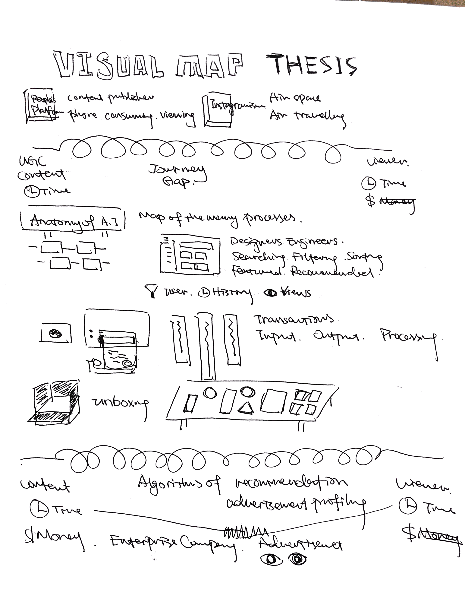

[Design Brief](https://github.com/youozhan/mfadt-thesisstudio-2/blob/master/Design_brief_mockup.pdf)

#### Feedback
* One person asked the question - "Do you want to go beyond informing and also critique?"
* Most important question voted by everyone - How can we model the dynamics in an algorithm-controlled system?
* One person expressed the interest in the research into "little attention has been paid by the audience to the impact from the digital interface"
* One person agrees with the fact that "Digital platforms can produce 'a harmonization of tastes' across the world"

