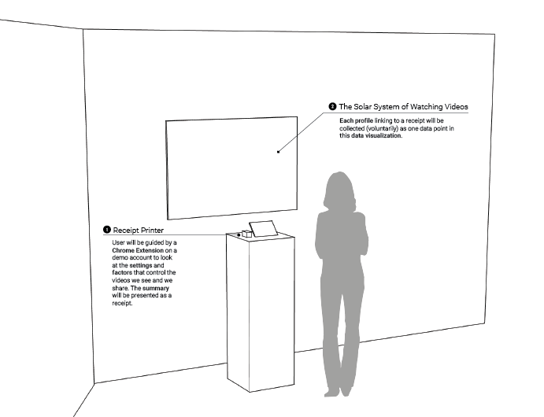

#### Final Presentation
[Thesis Final Review](https://github.com/youozhan/mfadt-thesisstudio-2/blob/master/Thesis_Midterm_Review.pdf)

#### Post-final reflection
Main feedback received:

MJ - great job presenting statistical research. very coherent. presenting the cosmology of the solar system of value. while you are being critical of it, still embracing the power of it. Question: why resist? **How could alternatives be presented?** What are other counter-proposals for living without this technology? Precedent: theyrule.net - data vis of corporate power. DataViz: can’t see the small type. Slime mold communicate sideways. Institute for Applied Autonomy - pre-Twitter project called “I see” / how to navigate Manhattan avoiding surveillance cameras.

AF - what is powerful about your project is the ability to quantify the information, straightforward display of information. **What can we do with this information?** Want to have the audience to ask question, how is the audience empowered to take ownership of online data? What do we do with the information? Could a different visual metaphor be used?

DJ - Is the end goal to have us change our privacy settings? What new question could you have us think about?

JI - Chrome extension: will access via laptop, tablet or phone? Data visualization needs more work - legibility, orientation, clarity. Utilize color to differentiate users? Per Danielle’s questin, **could there be a takeaway for the audience?**

Reflection on the feedback:
* This project did not reflect the whole ecosystem
* How to better emphasize the fact that "algorithm has its own intention and it is not about teaching us stuff"?
* Show some "gesture"

Must-dos in the following week:
* Uploading UI
* Polish the visual (consider alternate visualization structure in addition to the solar system)
* Finalize the documentation
* Brochure design (for the audience to continue looking at the project at home)
