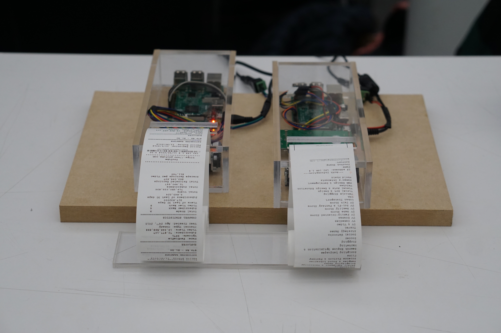
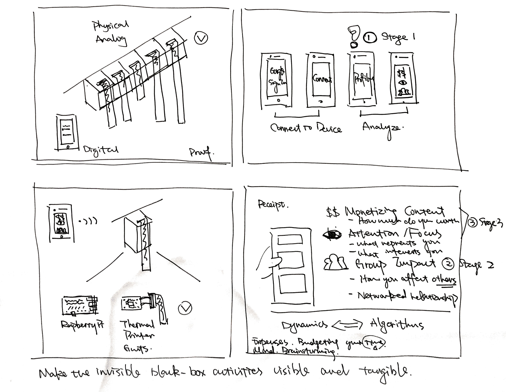

#### Prototype Share 1

*Inside the Box* is looking at how the algorithm-controlled system is affecting the everyday lives and what are the current public reactions responding to this problem. 

It is a product designed to be exhibited in a public space that intends to make the dynamics inside YouTube, a video-sharing platform visible and tangible. By presenting two objects in a set, it is forming a conversation between two different groups of information.

#### Feedback

*What do you think this is?* 

Keywords: YouTube account, Google account, data

*Where do you expect to see it?*

Keywords: public space, interaction.

*Which part of the information matters the most?*

Keywords: data, privacy, IP address.

#### 1v1 Meeting

Notes -
* "The Listening Post", NY Times Bldg, Bell Lab website sonic, "TV Delivers People", Jared Lanier, anthropological history of YouTube
* The idea of *Infinity Pool*
* Breadcrumb
* Consumer's labor, publisher's labor

