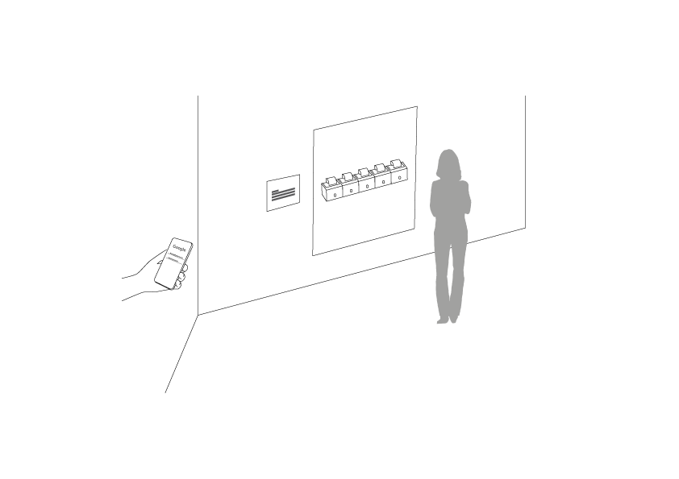
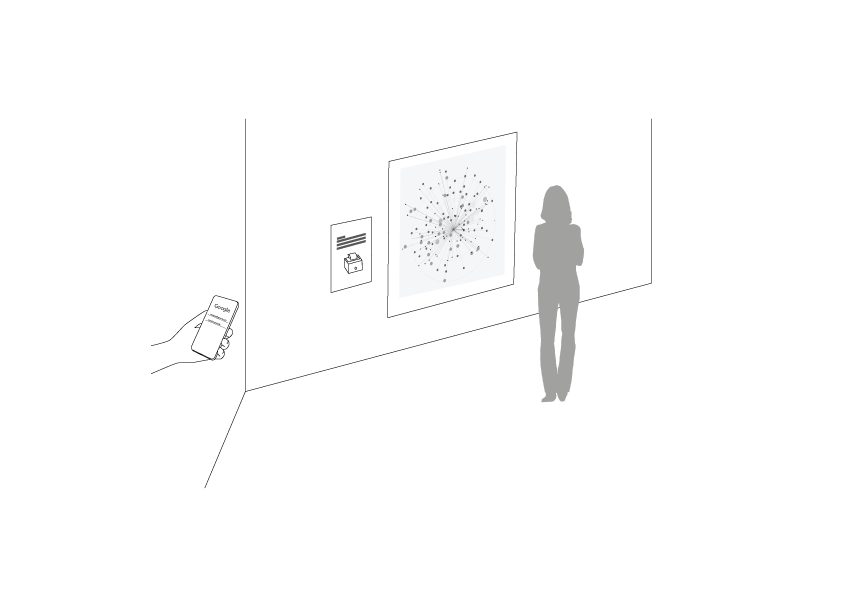

#### Science Fair Engagement
Two mockups and the receipt machine are presented together as the main proof of concept prototype. Two experimental prototypes are also tested to collect people's general interest in this topic. About seven visitors are tested at the science fair, each taking about 10 minutes.

Keywords from the feedback:

"Rating system" "Length of the tags" "View rank" "Like the tangible"
"Data stored in my phone" "Hard to understand" "Time spent on the Internet" "Algorithms control our experience" "Allow the user to experience the algorithms" "Artifacts" "Algorithm knows who you are"

Interactive prototypes will engage the visitor better, and help them understand where does the data come from, and how it flows. 

#### Key Questions
*What would drive the visitor to engage with the interactive installation?*

Depending on how likely the visitor understands the topic.

*What is the key information that will constitute the physical visualization?*

- Economy, financial data
- Monetizing the video
- Color correlating

#### Introduction of Experimental Prototypes
[The Story of Autoplay](Assets/StoryOfAutoplay.xlsx)

Autoplay is a setting exposed on the YouTube video page. By turning the setting on, YouTube will automatically play another related video based on the user’s viewing history. My journey of traversing about 48 videos started with “Drawing with Procreate on iPhone” and ended with “Apple Music - Florida Georgia Line + Memoji”. A nodejs npm module was being used to pull the meta information of all 48 videos for further analysis. There were multiple genres involved like “Howto & Style”, “Science & Technology” and “Entertainment”. The average length of the video is about 6 minutes. All videos have more than 10,000 views. There were more than half hours getting stuck with glass replacement videos, which is obviously based on one of the research I did for another project mainly about replacing phone screens. 

[The History of YouTube](Assets/HistoryOfYouTube.pdf)

Users were asked to go over the design of YouTube web version homepages starting from the year 2005. All screens were collected from web.archive.org. Most participants were able to point out the interface changes and aesthetic improvements. Nevertheless, only a few users noticed that Youtube has changed its design intention from encouraging a single user to upload videos, then developing a community for user-generated videos, to a platform for monetizing the video. On 2010, the “Recommended for you” section started to be prioritized. On 2011, the advertisement section takes the most important position out of all features. On below the advertisement, it is the trending videos with about 1 million views. The number of views is the most important factors to evaluate a YouTube video starting from the year of 2008. 

#### Proposal 1 vs. Proposal 2
More people voted for the second proposal as it provides an overview and a better context. 

#### Work Plan
February 21st - Test the Google connection
February 28th - Test the data visualization
March 5th - Fix the receipt format

#### Final Form
The project will be presented combining a physical visualization with a receipt printer to generate the individual components that construct the visualization. When the visitor walks into the space, he or she will see an unfinished visualization and a receipt printer. The visitor can connect to the receipt printer via Raspberry Pi. The Pi will have a local web server running, help the visitor to connect to his or her own Google account, and guide the visitor to go through a few Google settings. These settings not only enable the receipt printer to generate a digital profile for the visitor but also can remind the visitor of the existence of the settings.